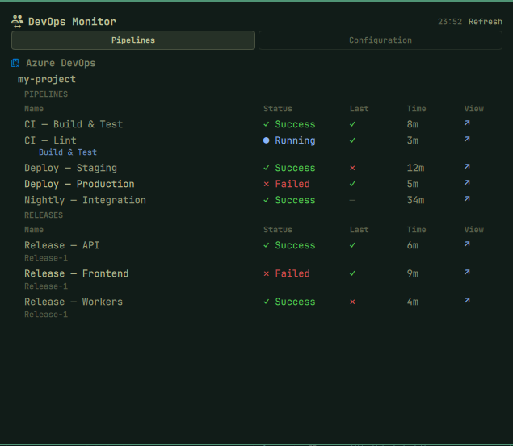

# DevOps Monitor



An [Omarchy](https://omarchy.org/) bar plugin that shows the real-time status of your Azure DevOps pipelines and Kubernetes clusters without leaving your desktop.

## Why DevOps Monitor?

When you are working across multiple terminals, editors, and browser tabs, switching to the Azure DevOps portal or `k9s` just to check if a pipeline passed breaks your flow. DevOps Monitor puts that information in the Omarchy bar — always visible, one click away.

It is not a replacement for Azure DevOps or `k9s`. It is a status layer that tells you at a glance whether everything is green so you can stay focused, or whether something needs your attention so you can go investigate with the right tool.

**What it answers:**
- Did my last pipeline run pass or fail?
- Is the previous run history consistent?
- How long did each pipeline take?
- Is my Kubernetes cluster healthy?

**What it does not do:**
- It does not let you trigger or cancel pipelines.
- It does not replace the Azure DevOps portal for detailed logs.
- It does not replace `k9s` for cluster management.

---

## Bar Widget

The plugin icon in the bar shows the pipeline icon with a status dot:

| Display | Meaning |
|---------|---------|
| `󰓋 +` | All providers healthy |
| `󰓋 !` | Warning — at least one pipeline failed or provider offline |
| `󰓋 x` | Critical failure |

- **Left-click** — open the DevOps Monitor panel
- **Right-click / Middle-click** — refresh immediately

---

## Panel

```
DevOps Monitor                          16:41  ↺ Refresh

Azure DevOps
  omarchylabs

    PIPELINES
    Name                  Status       Last  Time   View
    CI — Build & Test     ✓ Success    ✓     8m     ↗
    CI — Lint             ● Running    ✓     3m     ↗
    Deploy — Staging      ✓ Success    ✕     12m    ↗
    Deploy — Production   ✕ Failed     ✓     5m     ↗

    RELEASES
    Name          Status       Last  Time   View
    DEMO RELEASE  ✕ Failed     ✕     6m     ↗
    Release-2
```

### Columns

| Column | Description |
|--------|-------------|
| **Name** | Pipeline or release definition name. For releases, the specific release name (e.g. Release-2) is shown below in smaller text. |
| **Status** | Current run status: `✓ Success`, `● Running`, `✕ Failed`, `○ Unknown` |
| **Last** | Previous run status as a symbol — lets you spot a pattern (e.g. failed twice in a row) |
| **Time** | Duration of the current run in minutes |
| **View** | `↗` opens the pipeline or release directly in the browser |

### Release status

Release status is derived from the **environment (stage) status**, not the top-level release status. The Azure DevOps API keeps releases as `active` even when a stage is rejected. The plugin fetches the full release detail and checks each stage — if any stage is `rejected` or `failed`, the release shows `✕ Failed`.

### Scrolling

The panel scrolls vertically when there are more pipelines than fit in the visible area. Use the mouse wheel or touchpad to scroll.

### Refresh

The plugin refreshes automatically every 60 seconds. Click `↺ Refresh` in the panel header or right-click the bar icon to refresh immediately. The timestamp shows the time of the last successful refresh.

---

## Installation

```bash
omarchy plugin add https://github.com/heinsk/omarchy-devops-monitor.git --enable
```

Or manually:

```bash
cp -a devops-monitor ~/.config/omarchy/plugins/io.github.heinsk.devops-monitor
omarchy plugin enable io.github.heinsk.devops-monitor
omarchy-restart-shell
```

---

## Configuration

`~/.config/omarchy/plugins/io.github.heinsk.devops-monitor/config.json`

```json
{
  "providers": {
    "azureDevOps": true,
    "kubernetes": false
  },
  "azureDevOps": {
    "top": 50,
    "targets": [
      {
        "organization": "https://dev.azure.com/your-org",
        "project": "your-project"
      }
    ]
  },
  "development": {
    "mockData": false
  }
}
```

Multiple projects and organizations are supported — add more entries to `targets`.

---

## Requirements

### Azure DevOps

```bash
yay -S azure-cli
az extension add --name azure-devops
az login
```

### Kubernetes (optional)

```bash
# kubectl must be installed and configured
az aks get-credentials --resource-group YOUR-RG --name YOUR-CLUSTER
```

---

## Development

Enable mock data to develop without real infrastructure:

```json
{ "development": { "mockData": true } }
```

Test scripts directly:

```bash
python3 scripts/azure_devops.py --mock | python3 -m json.tool
python3 scripts/kubernetes.py   --mock | python3 -m json.tool
```

---

## Docs

| File | Description |
|------|-------------|
| [`docs/setup.md`](docs/setup.md) | Full setup guide including Kubernetes |
| [`docs/configuration.md`](docs/configuration.md) | All configuration options |
| [`docs/providers.md`](docs/providers.md) | Data shapes and provider details |
| [`docs/architecture.md`](docs/architecture.md) | How the plugin works internally |
| [`docs/testing.md`](docs/testing.md) | Testing guide |

---

## Security

- No credentials are stored by the plugin.
- Authentication delegates entirely to existing CLI sessions (`az`, `kubectl`).
- All subprocess output is treated as untrusted input.
- Scripts run with your user permissions — review the code before installing.

---

## Remove

```bash
omarchy plugin remove io.github.heinsk.devops-monitor
```

---

## License

MIT
